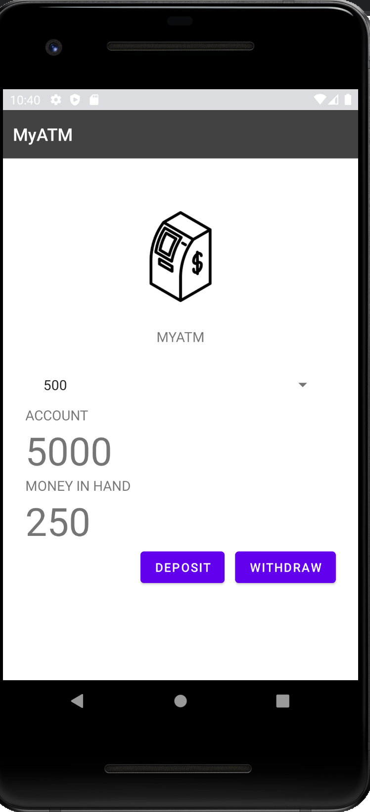

# Assignment 1: Writing your first Android program

CCCS 325 Assignment 1 |
Professor: Ben
Student: Lucas Napoli
Development: MyATM

# Creating my first Android App
## App Description

Simple Android application to perform deposits and withdrawals in a virtual ATM

# Important Information
1) Tests were performed in Pixel 2
2) Google Material tutorial was the base of this project
3) For the application style Google Material was implemented. 

### Screen Shot

License
----

MIT
**Free Software**
